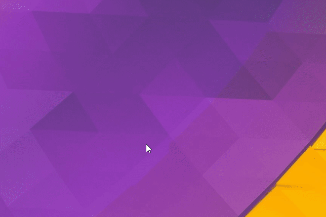

# BonziBuddy 5.0
_Based on tech from from Web 1.0_  
_Using Technology from Web 2.0_  
_Preparing for the Web 3.0_

_this is an unofficial BonziBuddy_

## Features
- [x] Draggable Bonzi
- [x] 100% Legitimate, Totally not Malware/Spyware
- [x] You can quit the program
- [ ] Not annoying

## Use
Simultaneously run `gatsby develop` and `yarn electron electron` at the same time.

## Animated Gif

## Thanks
- [ClippyJS](https://www.smore.com/clippy-js)
  - [_and it's ES6 rewrite supporting imports_](https://github.com/pi0/clippyjs)
- [GatsbyJS](https://www.gatsbyjs.org/)
  - gatsby-image
  - gatsby-plugin-manifest
  - gatsby-plugin-offline
  - gatsby-plugin-react
  - gatsby-plugin-sass
  - gatsby-plugin-sharp
  - gatsby-source-filesystem
  - gatsby-transformer-sharp
- [ReactJS](https://reactjs.org/)
- [ElectronJS](https://electronjs.org/)
  - Google Chrome - in a can!
