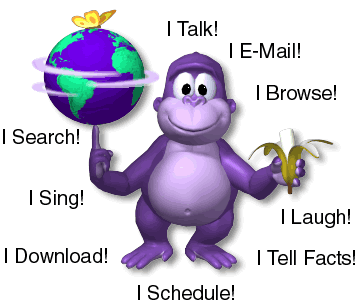

# BonziBuddy 5.0

  

(NOTE: This is open source computer software! He actually can't learn from you!)

Welcome to the world of **BonziBUDDY**! He will surf the web with you as your very own friend and sidekick! He can talk, walk, joke, browse, search, e-mail, and download like no other friend you've ever had on the net!

## Features
- [x] Draggable Bonzi
- [x] 100% Legitimate, Totally not Malware/Spyware
- [x] You can quit the program
- [ ] Not annoying

## Use
Simultaneously run `gatsby develop` and `yarn start` at the same time.

## System Requirements
- 1GB of RAM, 512MB of Free Disk Space
- Any Operating System that supports Electron
    - Microsoft Windows
      - Microsoft Windows 3.1
      - Microsoft Windows 7
      - Microsoft Windows Thin PC
      - Microsoft Windows Enbedded Standard 7
      - Microsoft Windows Embedded POSReady 7
      - Microsoft Windows Server 2008 R2
      - Microsoft Windows 8
          - Microsoft Windows RT is not supported
      - Microsoft Windows 8 with Bing
      - Microsoft Windows Embedded 8 Standard
      - Microsoft Windows Server 2008
      - Microsoft Windows Server 2008 R2
      - Microsoft Windows Embedded 8.1 Industry Pro
      - Microsoft Windows 10
      - Microsoft Windows Server 2016
      - Microsoft Windows Server 2019
  - Apple Macintosh
      - OS X 10.10 (Yosemite)
      - OS X 10.11 (El Capitan)
      - macOS 10.12 (Sierra)
      - macOS 10.13 (High Sierra)
      - macOS 10.14 (Mojave)
      - macOS 10.15 (Catalina)
  - Linux
      - Ubuntu 12.04 and newer
      - Fedora 21
      - Debian 8
- Sound Card

## Dependencies
- [ClippyJS](https://www.smore.com/clippy-js)
  - [_and it's ES6 rewrite supporting imports_](https://github.com/pi0/clippyjs)
- [GatsbyJS](https://www.gatsbyjs.org/)
  - gatsby-image
  - gatsby-plugin-manifest
  - gatsby-plugin-offline
  - gatsby-plugin-react
  - gatsby-plugin-sass
  - gatsby-plugin-sharp
  - gatsby-source-filesystem
  - gatsby-transformer-sharp
- [ReactJS](https://reactjs.org/)
- [ElectronJS](https://electronjs.org/)
  - Google Chrome - in a can!

---

  Copyright © 1995 - 2000 BONZI.COM Software 
  Copyright 2019 7coil 
   
  <i>
    Windows, Microsoft Internet Explorer, and Microsoft are registered trademarks of Microsoft Corporation. 
    OS X and macOS is a trademark of Apple Inc., registered in the U.S. and other countries 
    Ubuntu and Canonical are registered trademarks of Canonical Ltd. 
    Fedora® is a trademark of Red Hat, Inc. 
    Debian is a registered trademark of Software in the Public Interest, Inc. 
    Linux® is the registered trademark of Linus Torvalds in the U.S. and other countries 
    BonziBUDDY and BONZI are trademarks of BONZI.COM Software. 
    All rights and liabilities with respect to BonziBUDDY belong solely to BONZI.COM Software. 
    Copyright © 1995 - 2019 
    All Rights Reserved.
  </i>

